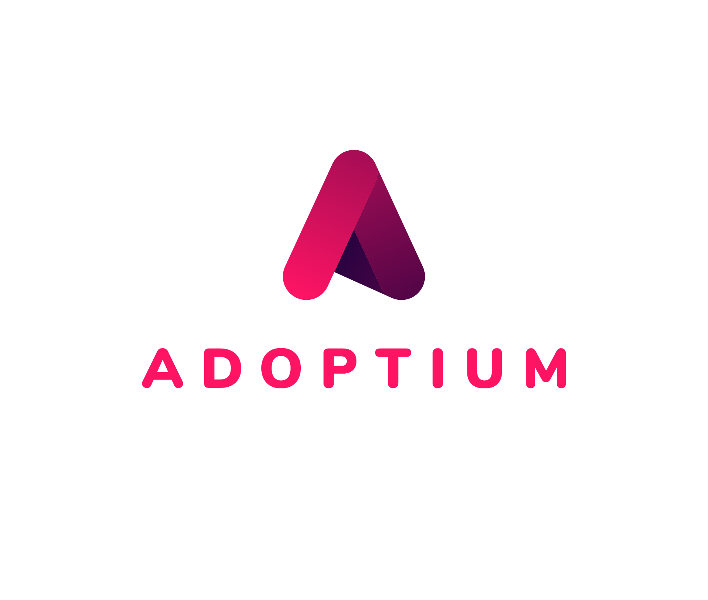

---
hide:
  - navigation
  - toc
---

<div class="java-hero" markdown>
# :fontawesome-brands-java: Java {{ java_17.jdk_standerd.config.version }} LTS
</div>

<div class="hero-arch-badges" markdown>
<span class="arch-badge">:material-memory: linux/amd64</span>
<span class="arch-badge">:material-memory: linux/arm64</span>
</div>

<div class="integration-stack">
    
    <span class="integration-divider">+</span>
    
    <span class="integration-divider">+</span>
    
    
</div>

???+ info "Adoptium Upstream Release Metadata"
    | Source Property | Value |
    | :--- | :--- |
    | **Full Version** | `{{ java_17.jdk_standerd.config.full_ver }}` |
    | **SemVer** | `{{ java_17.jdk_standerd.config.semver }}` |
    | **Security Level** | `psu-{{ java_17.jdk_standerd.config.sec_level }}` |
    | **Upstream Update** | `⏱️ {{ java_17.jdk_standerd.config.upstream_update }}` |
    | **Distribution** | [Eclipse Temurin by Adoptium](https://adoptium.net) |

---


{% set flavors = [
('jdk_standerd', 'Java Development Kit (JDK)', 'material-toolbox-outline', 'Full Development Suite', 'Comprehensive environment containing the JDK, shell, and package manager for building and debugging applications.'),
    ('jre_standerd', 'Java Runtime Environment (JRE)', 'material-package-variant', 'Standard Production Runtime', 'Standard environment for running Java applications, equipped with a shell and system utilities for operational flexibility.'),
    ('jre_distroless', 'Java Runtime Environment (Distroless)', 'material-shield-check', 'Hardened Production Runtime', 'Minimalist rootfs with zero shell and zero utilities, optimized for high-assurance production environments.')] %}


=== ":{{ icon }}: {{ title }}"

    !!! success "{{ policy_header }}"
        **Security Policy:** {{ policy_text }}

    ### :material-docker: Artifact Registry

    **Pull by Version Tag**
    ```bash
    docker pull {{ java_17[key].tags[0] }}
    ```

    **Pull by Floating Tag**
    ```bash
    docker pull {{ java_17[key].tags[1] }}
    ```

    **Pull by Immutable Digest (Recommended)**
    ```bash
    docker pull {{ repo_of_registry }}@{{ java_17[key].main.provenance.digest }}
    ```

    <p class="integrity-meta">
        Integrity Metadata: :material-file-certificate: [L3 Provenance]({{ java_17[key].main.provenance.url }}) | :material-barcode-scan: [CycloneDX SBOM]({{ java_17[key].main.sbom.url }})
    </p>

    ---

    #### :material-file-chart-outline: Security & Compliance Reports

    === ":material-shield-search: Vulnerability Scan"

        
        
        
        
        

        
          
            
              
            
            
              
              
                
                
                
                
                
                
              
            
          
        
        

        **Target:** `{{ artifact_name }}` &nbsp;|&nbsp; **Scanner:** `Trivy v{{ trivy_version }}`

        <div class="grid cards" markdown>

        -   :material-shield-bug: **Total CVEs Found**

            <span style="color: {{ '#00c853' if total_vulns == 0 else '#d50000' }}; font-size: 2.2em; font-weight: 900;">{{ total_vulns }}</span>
            <br>
            *Detected in Image Layers*

        -   :material-package-variant-closed: **Packages Analyzed**

            <span style="font-size: 2.2em; font-weight: bold;">{{ ns.pkg_count }}</span>
            <br>
            *Verified Dependencies*

        -   :material-lightning-bolt: **Critical / High**

            <span style="color: {{ '#00c853' if (ns.critical + ns.high) == 0 else '#d50000' }}; font-size: 2.2em; font-weight: 900;">{{ ns.critical + ns.high }}</span>
            <br>
            *Immediate Action*

        -   :material-information: **Medium / Low**

            <span style="color: {{ '#00c853' if (ns.medium + ns.low) == 0 else '#ffb300' }}; font-size: 2.2em; font-weight: bold;">{{ ns.medium + ns.low }}</span>
            <br>
            *Risk Mitigation*

        </div>

        
        !!! success "Zero-CVE State Confirmed :material-check-decagram:"
            **Impeccable Security Posture:** No known vulnerabilities were detected in the `{{ ns.pkg_count }}` analyzed packages. 

        <div style="text-align: center; padding: 30px; background: #f1f8e910; border-radius: 12px; border: 2px dashed #00c853; margin: 20px 0;">
            <div style="font-size: 4em; margin-bottom: 10px;">🛡️</div>
            <h3 style="color: #00c853; font-weight: 800; margin: 0;">Clean Security Signature</h3>
            <p>No active threats detected in the <b>{{ ns.pkg_count }}</b> analyzed components.</p>
        </div>
        
        !!! warning "Vulnerability Remediation Required :material-alert:"
            **{{ total_vulns }} security exception(s)** identified. Review the forensic log below.

        #### :material-chart-donut: Severity Distribution

        ```vegalite
        {
          "$schema": "https://vega.github.io/schema/vega-lite/v5.json",
          "data": {
            "values": [
              {"category": "Critical", "value": {{ ns.critical }}, "color": "#d32f2f"},
              {"category": "High", "value": {{ ns.high }}, "color": "#f57c00"},
              {"category": "Medium", "value": {{ ns.medium }}, "color": "#fbc02d"},
              {"category": "Low", "value": {{ ns.low }}, "color": "#1976d2"}
            ]
          },
          "transform": [ { "filter": "datum.value > 0" } ],
          "mark": {"type": "arc", "innerRadius": 60, "tooltip": true, "stroke": "#fff", "strokeWidth": 2},
          "encoding": {
            "theta": {"field": "value", "type": "quantitative"},
            "color": {
              "field": "category", "type": "nominal",
              "scale": {
                "domain": ["Critical", "High", "Medium", "Low"], 
                "range": ["#d32f2f", "#f57c00", "#fbc02d", "#1976d2"]
              }
            }
          },
          "width": "container", "height": 250
        }
        ```

        #### :material-table-eye: Forensic Vulnerability Log

        | Severity | CVE ID | Affected Package | Status | Fix Available |
        | :---: | :--- | :--- | :--- | :---: |
        
        | :material-lightning-bolt:{ .md-typeset__error }:material-alert:{ style="color: #f57c00" }:material-alert-circle:{ style="color: #fbc02d" } | [`{{ v['VulnerabilityID'] }}`]({{ v['PrimaryURL'] }}) | `{{ v['PkgName'] }}` | {{ v['Status'] | title }} | :material-check-circle:{ style="color: #4caf50" } Yes:material-help-circle:{ style="color: #9e9e9e" } Pending |
        
        

        #### :material-package-variant-closed: Software Bill of Materials (SBOM)

        | Component Name | Version | License | Classification |
        | :--- | :--- | :--- | :--- |
        
          
            
              
        | **`{{ p['Name'] }}`** | `{{ p['Version'] }}` | {{ p['Licenses'] | join(', ') if p['Licenses'] is iterable and p['Licenses'] is not string else p['Licenses'] | default('N/A') }} | :material-linux: System (Wolfi):material-coffee: Java Runtime |
              
            
          
        
        <br>
        !!! tip "Supply Chain Transparency"
            **[:material-file-download: Download SBOM JSON]({{ sbom_url }})**

    === ":fontawesome-brands-docker: Docker CIS"

        
        

        {# --- Logic: Separate Controls using Namespace --- #}
        
        
          
            
          
            
          
        

        {# --- Stats Calculation --- #}
        
        
        
        

        **Target:** `{{ title }}` &nbsp;|&nbsp; **Profile:** Level 1 - Container &nbsp;|&nbsp; **Benchmark Ver:** `{{ cis_data['ID'] }}`

        <div class="grid cards" markdown>

        -   :material-shield-check: **Automated Score**
            ---
            
            <span style="color: #00e676; font-size: 2.2em; font-weight: bold;">{{ success_rate }}%</span>
            
            <span style="color: #ff9100; font-size: 2.2em; font-weight: bold;">{{ success_rate }}%</span>
            
            <span style="color: #ff1744; font-size: 2.2em; font-weight: bold;">{{ success_rate }}%</span>
            
            <br>
            *Based on {{ total_auto }} Automated Checks*

        -   :material-clipboard-text-clock: **Manual Review**
            ---
            <span style="color: #2979ff; font-size: 2.2em; font-weight: bold;">{{ cis_ns.manual | length }}</span>
            <br>
            *Requires Operational Audit*

        -   :material-alert-circle-outline: **Blocking Failures**
            ---
            <span style="color: {{ '#00e676' if failed_auto == 0 else '#ff1744' }}; font-size: 2.2em; font-weight: bold;">{{ failed_auto }}</span>
            <br>
            *Critical Config Errors*

        </div>

        
        !!! failure "Compliance Gaps Detected"
            The image has failed some automated hardening checks. Review the detailed log for remediation steps.
        
        !!! info "Operational Context Required"
            Automated checks passed. Manual controls (e.g., Content Trust) must be verified at the host level.
        

        #### :material-table-search: Detailed Audit Log

        | Status | ID | Control Description | Severity |
        | :---: | :---: | :--- | :---: |
        
        | :material-check-circle:{ style="color: #00e676" title="Passed" }:material-close-circle:{ style="color: #ff1744" title="Failed" } | **{{ control['ID'] }}** | {{ control['Name'] }} | {{ control['Severity'] }} |
        

        #### :material-human-edit: Manual Review Controls

        | Status | ID | Control Description | Severity |
        | :---: | :---: | :--- | :---: |
        
        | :material-clipboard-alert:{ style="color: #2979ff" } | **{{ control['ID'] }}** | {{ control['Name'] }} | {{ control['Severity'] }} |
        

        ---

        **Audit Legend:**
        <br>
        :material-check-circle:{ style="color: #00e676" } **Passed:** Hardcoded configuration is correct.
        <br>
        :material-close-circle:{ style="color: #ff1744" } **Failed:** Violation detected in image layers.
        <br>
        :material-clipboard-alert:{ style="color: #2979ff" } **Manual:** Host/Infrastructure level responsibility.   
        <br>


    === ":material-kubernetes: K8s NSA"

        
        

        {# --- Logic: Separate Controls (Container vs Cluster) --- #}
        
        
          
            
          
            
          
        

        
        
        
        

        **Scope:** `{{ title }}` &nbsp;|&nbsp; **Guidance Ver:** `1.0` &nbsp;|&nbsp; **Profile:** `Container Hardening`

        <div class="grid cards" markdown>

        -   :material-bullseye-arrow: **Image Adherence**
            ---
            <span style="color: {{ '#00c853' if compliance_percent == 100 else '#ffab00' }}; font-size: 2.2em; font-weight: 900;">{{ compliance_percent }}%</span>
            <br>
            *Verified Configuration*

        -   :material-clipboard-text-clock: **Infrastructure Dependency**
            ---
            <span style="color: #2979ff; font-size: 2.2em; font-weight: 900;">{{ nsa_ns.manual | length }}</span>
            <br>
            *Cluster-Level Controls*

        -   :material-alert-rhombus: **Actionable Violations**
            ---
            <span style="color: {{ '#00c853' if failed_auto == 0 else '#d50000' }}; font-size: 2.2em; font-weight: 900;">{{ failed_auto if failed_auto > 0 else 'Zero' }}</span>
            <br>
            *Direct Container Risks*

        </div>

        !!! abstract "Shared Responsibility Disclaimer"
            The NSA/CISA hardening guidance for `{{ title }}` focuses on container-level security. 
            *   **Image Scope:** We enforce non-root users and file system integrity.
            *   **Cluster Scope:** Infrastructure controls (e.g., NetworkPolicies, RBAC) must be applied by the **Cluster Admin**.

        #### :material-view-list: Control Matrix (Automated Checks)

        | ID | Hardening Control | Severity | Audit Status |
        | :---: | :--- | :---: | :---: |
        
        | **{{ control['ID'] }}** | {{ control['Name'] }} | {{ control['Severity'] }} | :material-check-decagram:{ style="color: #00c853" title="Compliant" }:material-close-octagon:{ style="color: #f44336" title="Violation" } |
        

        #### :material-server-security: Cluster Admin Responsibility (Manual)

        | ID | Hardening Control | Severity | Responsibility |
        | :---: | :--- | :---: | :---: |
        
        | **{{ control['ID'] }}** | {{ control['Name'] }} | {{ control['Severity'] }} | :material-kubernetes:{ style="color: #326ce5" title="Cluster Admin" } |
        

        ---
        **Hardening Principles Applied:**
        1.  **Non-Root Execution:** Container runs as a non-privileged user to limit exploit impact.
        2.  **Verified Toolchain:** All system components are sourced from the hardened Wolfi ecosystem.
        3.  **SBOM Transparency:** Full CycloneDX SBOM is provided for all included dependencies.


        
        <br>


    === ":material-lock-check: K8s PSS"

        
        
        
        
        

        **Enforcement Level:** `Restricted` &nbsp;|&nbsp; **Scope:** `Build Environment Isolation` &nbsp;|&nbsp; **K8s Ver:** `v1.24+`

        <div class="grid cards" markdown>

        -   :material-police-badge: **Policy Status**
            <br>
            
            <span style="color: {{ compliance_color }}; font-size: 2em; font-weight: 900;">READY</span>
            <br><span style="font-size: 0.8em;">*SDK is Restricted-Capable*</span>
            
            <span style="color: {{ compliance_color }}; font-size: 2em; font-weight: 900;">BLOCKED</span>
            <br><span style="font-size: 0.8em;">*Static Validation Failed*</span>
            

        -   :material-lock-check: **Rules Satisfied**
            <br>
            <span style="font-size: 2em; font-weight: 900;">{{ passed_rules }}</span>
            <span style="color: #9e9e9e;"> / {{ total_rules }}</span>
            <br>
            *Baseline + Restricted Policies*

        -   :material-skull-crossbones: **Blocking Violations**
            <br>
            <span style="color: {{ compliance_color }}; font-size: 2em; font-weight: 900;">{{ failed_rules }}</span>
            <br>
            *Must Resolve in Dockerfile*

        </div>

        
        !!! critical "Compliance Gap Detected"
            The image contains configurations that will trigger a rejection from the Kubernetes Admission Controller in restricted environments.
        
        !!! success "Secure Pipeline Ready"
            The variant satisfies all **Static PSS Checks**. It is safe to use as a CI/CD build agent in hardened, multi-tenant Kubernetes clusters.
        

        #### :material-clipboard-list-outline: Policy Enforcement Matrix

        | ID | Restriction Rule | Severity | Static Audit |
        | :---: | :--- | :---: | :---: |
        
        | `{{ rule['ID'] }}` | **{{ rule['Name'] }}** | {{ rule['Severity'] }} | :material-check-all:{ .md-typeset__success title="Satisfied" }:material-cancel:{ .md-typeset__error title="Violated" } |
        

        ---
        <br>
        **Why This Matters:**
        <br>
        1.  **Isolation:** Prevents access to host network or sensitive kernel namespaces.
        <br>
        2.  **Least Privilege:** Ensuring build agents run as non-root prevents "Escape-to-Host" attacks.
        <br>
        3.  **Consistency:** Matches the security posture of the production `Distroless` image.


